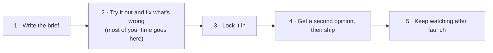
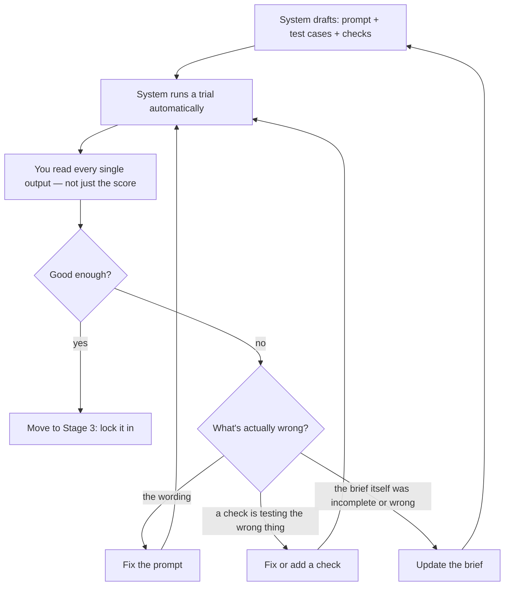

# Launching a Brand-New Prompt

This is the journey for a prompt that doesn't exist yet — no prior version, no prior tests, nothing to build on. It has five stages. Here's the whole thing at a glance:

The middle stage — trying it out and fixing what's wrong — is deliberately where most of the effort lives. Everything before it should take minutes; everything after it should be fast because the hard thinking already happened there.

## Stage 1 — Write the brief

Covered in full in [01-the-spec.md](01-the-spec.md). Short version: write down the name, what "good" looks like, and what goes in/comes out. Save it.

## Stage 2 — Try it out and fix what's wrong

The moment the brief is saved, the system does something for you automatically, in one action: it drafts a first attempt at the prompt, a first small set of test inputs (seeded from your examples and edge cases), and the checks that will grade the results — then immediately runs that first attempt against those checks and shows you the results. You didn't have to set any of that up by hand; you get a first data point within seconds of finishing the brief.

**The single most important habit in this whole process: read the actual outputs, not just the pass rate.** A trial that passes 100% on its first try is far more often a sign the test cases aren't challenging the prompt yet than a sign the prompt is actually done — the first batch of tests is intentionally small, seeded mostly from your own examples. Read every output (it's only a few dozen at this stage), jot a short note on anything that looks wrong even if it technically "passed," and don't trust a clean scoreboard until the test cases themselves have earned your trust.

### When something's wrong, there are only three possible culprits

This is the part worth internalizing, because reaching for the wrong fix wastes time and can quietly make your tests worse instead of better:

- **Most often, it's the wording.** The brief was clear and correct; the prompt just didn't fully follow it yet. This is the cheapest, fastest fix — edit the prompt, try again.
- **Occasionally, a check is wrong, not the prompt.** The brief's intent was correct and clear, but whoever (or whatever) wrote the check for it got the check itself wrong — testing the wrong thing, or testing it too strictly or too loosely. This is a narrower case than it might feel like in the moment: before you decide "the check is broken," make sure it's not actually the first case (wording) or the third (the brief itself needs updating).
- **Sometimes the brief itself was incomplete or wrong.** You discover, in the middle of iterating, that the original brief didn't actually specify the right behavior — a requirement was missing, or it was too vague to pin down what "correct" even means here. This is the biggest fix: go back and sharpen the brief, which naturally cascades into fresh prompt and test drafts for whatever changed.

Every fix — however big or small — gets tried again automatically against the same test set, so you can immediately tell whether it actually helped before moving on.

### A standing safety net: is every requirement actually being checked?

Keep a simple, always-visible checklist next to the brief: for every success measure and guardrail you wrote down, is there currently a check that actually verifies it? This is what makes "make a change and see if it still passes" a trustworthy signal for every future edit — a re-run can only catch what it's actually checking, so an uncovered requirement is a silent gap, not a passing grade.

## Stage 3 — Lock it in

Once trial results are stable and genuinely good — not just clean by accident of an easy test set — you formally lock in this version. Locking in is a single, deliberate action that freezes everything together at once: the brief, the prompt, every check, the test set, and the grading rules. There's no partial state where the prompt is locked but the tests aren't, or vice versa — it's one bundle, frozen together, so what gets reviewed next is guaranteed to be self-consistent.

Locking in immediately triggers one more automatic run of the exact same trial — now formally on the record as the version's official result, the one that gets cited as evidence going forward, rather than something anyone has to just take on faith.

**A note on the automated grader, if this prompt uses one.** Some checks are simple pass/fail rules a computer can verify directly (does the answer contain X, is it valid structured data, is a number in range). Others are inherently more subjective — tone, persona, nuanced correctness — and get graded by an AI acting as a judge instead. If your checks include one of these AI-graded checks, it's genuinely good practice to spot-check that grader against a handful of examples you've scored by hand yourself, to build confidence it agrees with a human before you lean on it. That said, **this is a recommendation, not a requirement that blocks locking in** — you're free to do it whenever it adds value, but it won't hold up shipping a version that's otherwise ready.

## Stage 4 — Get a second opinion, then ship

Locking in a version is not the same as approving it for release — those are two different moments, on purpose. The locked bundle goes through a short review, styled like a code review rather than a rubber-stamp:

- The reviewer sees everything that changed at once: the brief, the prompt wording, the checks, the test set, and the official run's results — compared side-by-side against whatever's live today, if anything is.
- Comments can be left directly on any specific piece — a line of the brief, a specific check, a specific test row, a specific result — and stay attached to that version's history going forward, so the reasoning behind a decision isn't lost.
- An AI assistant does a first pass automatically before the human does: flagging things like a requirement with no check covering it, an oddly-worded check, a suspicious jump in the pass rate, or a cost/speed regression. **The assistant only comments — it never approves.** The decision always belongs to a person.
- **The reviewer should not be the same person who wrote the brief or tuned the prompt.** Ideally it's the person who owns the quality bar for this prompt in the first place (see [04-roles-responsibilities-and-approvals.md](04-roles-responsibilities-and-approvals.md)) — the person best placed to judge whether any remaining rough edges are actually acceptable.
- The verdict is either **Approve** or **Request changes**. A request for changes sends things back into Stage 2's fix loop — because the reviewed version is already locked, any fix creates a fresh version rather than quietly editing the one that was reviewed, and comes back for review again once it's ready.

Once approved, the version is released — it becomes the live, current version being served to real users, with the official run kept on record as the evidence that justified shipping it.

## Stage 5 — Keep watching after launch

Shipping isn't the finish line. The same checks that gated the release should keep grading a sample of real, live usage on an ongoing basis, so "did we ship something good" and "is it still good in production" are answered by the exact same yardstick, not two different ones. What that ongoing loop looks like, and how real failures feed back into sharper tests (and sometimes a sharper brief), is covered in [05-continuous-quality-and-feedback-loop.md](05-continuous-quality-and-feedback-loop.md).

## The one-paragraph version

Write the brief, let the system draft everything from it, spend your real effort reading real outputs and fixing whichever of three things is actually wrong (wording is small, a bad check is medium, the brief itself is the big one), lock it all in together once it's genuinely good, get a second opinion from someone who wasn't the author, ship it — and then keep watching real usage, because that's where the sharpest lessons come from.
