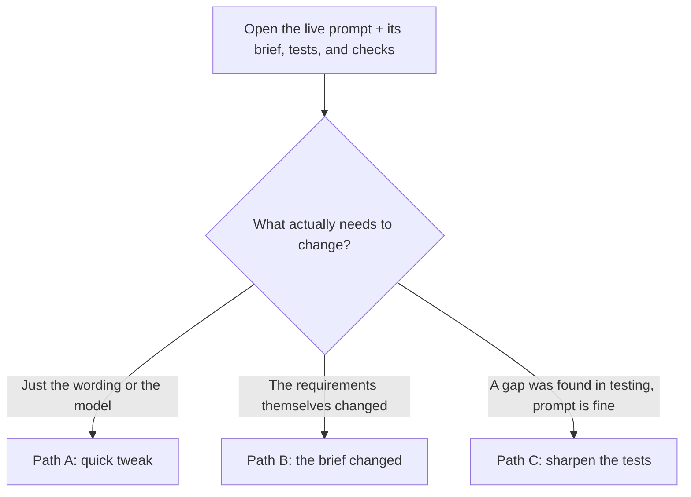

# Updating an Existing Prompt

Once a prompt is live, "make a change" is not one workflow — it's three different ones, depending on **why you're actually touching it**. Picking the right one matters because it determines how much gets re-checked, and whether the new version is proven against the old one automatically.

## At a glance

| | The brief | The tests/checks | The prompt | How it's proven |
|---|---|---|---|---|
| **Path A — wording tweak** | unchanged | unchanged | new version | side-by-side against the current live version, same tests |
| **Path B — requirements changed** | new version | updated for what changed, rest kept | usually new version | side-by-side against the current live version, plus the new requirements |
| **Path C — sharpen the tests** | usually unchanged | new/updated | **unchanged** | run the *current* live prompt against the sharper bar, see if it already holds up |

---

## Path A — Just the wording (or model) changed

**When this applies:** you believe you can word it better, or want to try a different model — but what the prompt is supposed to accomplish hasn't changed at all.

**The goal:** prove the new wording is at least as good as what's live today, on the exact same bar, before it's allowed to replace it.

1. Open the current live version — its brief, tests, and checks are all visible right alongside it.
2. Edit the wording (or model settings). This creates a new version of the prompt only.
3. **Don't touch the tests or checks** — reuse them exactly as they are, since what "good" means here hasn't changed.
4. Run the new wording **and** the current live wording through the exact same tests, side by side, in one go. This is a built-in comparison, not a separate manual step someone has to remember to do.
5. Read the comparison: pass rate, cost, and speed, old vs. new.
   - **No regression, meets the bar:** proceed to lock in and release, same as a brand-new prompt's later stages.
   - **Something got worse:** stay in the fix loop — adjust the wording again, re-run the same comparison, repeat.

## Path B — The requirements themselves changed

**When this applies:** a new business rule, a compliance requirement, an edge case a customer hit in the real world, a stakeholder wanting genuinely different behavior. The bar itself has to move, not just the prompt's ability to clear it.

1. Update the brief first: add or edit the specific requirements that changed.
2. **The system proposes only what actually needs to change, not a full do-over.** Whatever in the tests and checks isn't affected by the update stays exactly as it was — including anything you've since hand-tuned — so updating one requirement never silently wipes out unrelated manual work. For the parts that *did* change, the system suggests updates and clearly shows them as suggestions to review, never as silent overwrites.
3. From here it's the same read-outputs-and-fix loop as launching a brand-new prompt, just starting from "what changed" instead of from scratch.
4. Run it as a comparison too: the new version against the currently-live one, so a single run answers two questions at once — does it meet the *new* bar, and did it accidentally break anything the *old* bar was still checking for.
5. Lock in and get a second opinion, same as always — but make sure the reviewer sees clearly **what changed in the requirements themselves**, not just the prompt wording, since that's really what's being signed off on here.

## Path C — A gap was found, but the prompt itself is fine

**This is the most common loop of all, not a rare edge case.** The single best way an organization's tests actually get better over time is by learning from real failures — not from guessing upfront what might go wrong. This path is how a specific, real lesson (a production incident, a pattern spotted while reviewing real usage, a new policy that should apply retroactively) turns into a permanent, sharper check — without necessarily touching the prompt at all.

**Typical triggers:** a real customer interaction reveals a case nobody thought to test; a review of recent usage turns up a recurring pattern of a certain kind of mistake; a new guardrail needs to apply going forward, even to cases that were previously untested.

1. No brief update is strictly required (though a short note added to the brief for traceability is good practice). No prompt change is needed at all, yet.
2. **If a real customer example is being turned into a permanent test case, personal or sensitive details must be scrubbed first.** A live interaction naturally clears out sensitive details automatically after a short window — but a permanent test case doesn't expire the same way, so anything copied in for good needs to be cleaned up before it's saved that way.
3. Add the new, sharper test case and/or the new check to a fresh version of the test set — the currently-live prompt stays completely untouched.
4. Run the **current, already-live prompt** against this sharper bar. This checks one specific question: does what's already shipped hold up against the newly-discovered case?
5. **If it passes:** lock in just the sharper tests — no prompt version needed, since none was created. This raises the bar for every future version of this prompt immediately, and, once live monitoring is fully wired up, the same sharper bar can be checked against real ongoing traffic right away.
6. **If it fails:** now you have a concrete, reproducible example of exactly what's broken — hand this straight to Path A or Path B, whichever fits. This is the natural bridge between "we found a real quality gap" and "now go fix the prompt," grounded in an actual failing example instead of a vague complaint.

## Why comparisons are always side-by-side, not a separate step

In every path above, a new version is checked directly against whatever's currently live, in the same run, rather than being evaluated in isolation and compared informally afterward. Treat "old vs. new, same test, same checks" as the default way any change gets validated — a standalone check with no baseline to compare against should be the rare exception (mainly, a genuinely brand-new prompt with nothing to compare to yet), not the norm.
