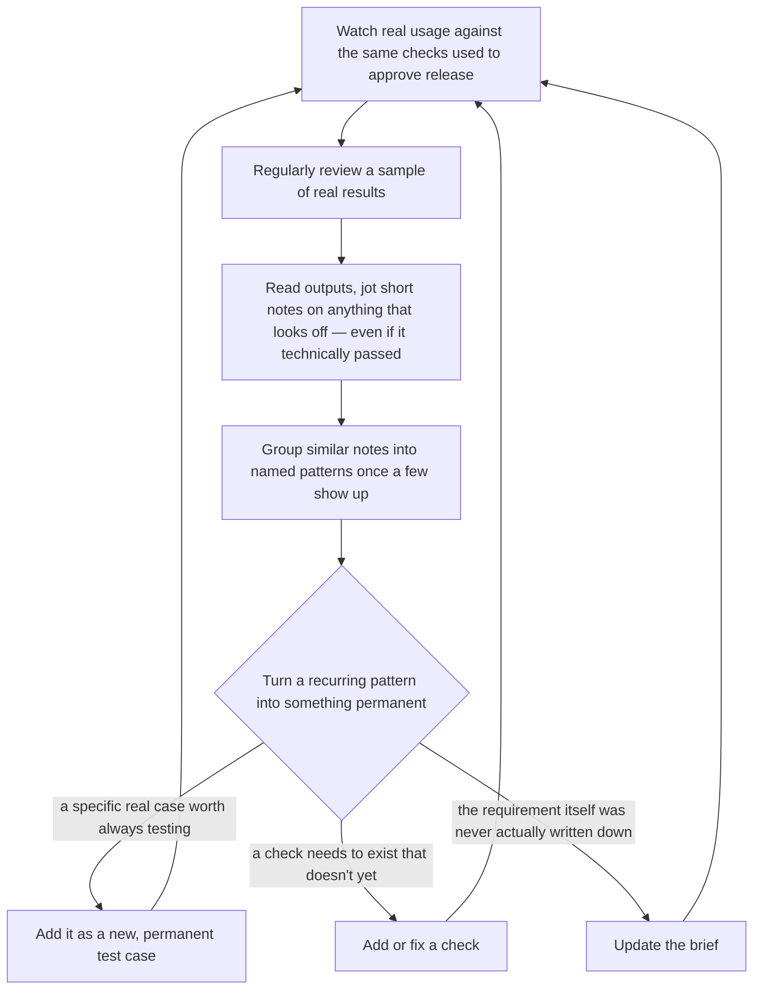

# Continuous Quality and the Feedback Loop

Shipping a version is not the finish line — it's the point where the most valuable source of new information actually opens up: real usage. This doc covers what happens after release, and how the whole system is meant to keep getting better rather than staying frozen at whatever the team thought of on day one.

## Why this matters more than the initial testing does

The initial trial-and-fix work described in [02-launching-a-brand-new-prompt.md](02-launching-a-brand-new-prompt.md) is deliberately based on a small set of examples — mostly what was written into the brief up front, plus a modest number of made-up extra cases. That's enough to sanity-check a first attempt, but it can never anticipate everything real usage will throw at it. **The real engine of quality improvement is reading actual results and real usage, not the original guesses written into the brief.** Treat the ongoing loop described below as the main event, not a footnote — expect to run it continuously, far more often than a full prompt rewrite.

## The loop, at a glance

## Step by step

### 1. Keep watching after launch

The same checks that gated release should keep grading a regular sample of real, live usage — not just at launch, on an ongoing basis. This means "did we ship something good" and "is it still good right now" get answered by the exact same yardstick, rather than one bar for the demo and a different, unmeasured reality afterward.

**A note on where we are today:** fully automatic, always-on live monitoring is the target end state, and it's coming, but isn't fully wired up yet. In the meantime, the equivalent habit is regularly pulling in and reviewing batches of real usage or exported reports on a set cadence, rather than a continuous live feed — same discipline, more manual sourcing for now.

**Automated grading is not the whole review pool — this is worth being explicit about.** Only some real traffic ever gets graded by a check (limited sampling, cost, or simply not wired up yet). Reviewing real usage means reading actual outputs regardless of whether a check ran on them, not just the subset that happens to have a pass/fail score attached. A check can only ever catch what it was already built to look for — the ungraded majority of traffic is exactly where a genuinely new failure pattern is most likely to be hiding, since nothing has filtered it yet.

### 2. Review real results on a regular cadence, not just when something breaks

Waiting for a complaint or an incident before looking at real usage means you only ever see the failures someone was upset enough to report — a small and biased sample of what's actually happening. Build in a standing habit of periodically sampling and reading real results, successes included, so quieter failure patterns don't stay invisible.

### 3. Read the actual outputs — this is the highest-leverage habit in the whole process

Skimming a pass-rate number is not the same as reading what actually happened. For each result you're reviewing:

- **Write a short, honest note on anything that looks wrong** — "wrong tone for this situation," "made up a policy that doesn't exist" — before trying to fit it into an existing category. Forcing a note into a predefined bucket too early is exactly how new, unexpected failure patterns stay hidden.
- **Render results the way a person would actually read them** — an email formatted like an email, structured data shown in its actual shape — not a raw technical dump that's hard to actually evaluate.
- **Prioritize what's most likely to be interesting** (results a check already flagged as failing, or results with low grader confidence, or ones with negative user feedback) — but keep mixing in a few random ones too, so patterns with no existing signal don't stay permanently invisible. **"Random" has to include usage no check has ever touched, not just a random pick among already-graded results** — otherwise the sample is silently pre-filtered by whatever the checks already know to look for, and the one place a brand-new failure mode is most likely to surface never gets read at all.
- **Keep reviewing until new patterns stop showing up**, not for a fixed number of items — once you've gone through a solid stretch without finding anything new, that's the natural stopping point, not an arbitrary quota.

### 4. Make it easy to act on what you find — not just record it

Notes that pile up without ever turning into an actual fix are wasted effort. A finding should be one step away from becoming a concrete update, ideally with a drafted first attempt at the fix ready for a quick human confirmation rather than a blank page:

- **A recurring, serious pattern → a new or fixed check.** If a real example is the clearest illustration of a mistake worth always catching going forward, propose the actual check needed to catch it, not just a description of the problem.
- **A specific tricky case → a permanent test case.** So the exact scenario that once slipped through stays part of the test set forever, protecting against the same mistake resurfacing in a future version.
- **A requirement that was never actually written down → an update to the brief.** Sometimes a real failure reveals that the original brief simply never specified the right behavior in the first place. When that's the case, the fix belongs in the brief itself, not just downstream — that's how the brief keeps growing to reflect what's actually been learned, instead of staying frozen at day one.
- **Sometimes the most direct fix is just the prompt wording.** Not every finding needs a new check or a brief update — if the fix is obviously "add an explicit instruction covering this," go straight there.

Whichever of these it becomes, a proposed fix should always be reviewed and confirmed by a person before it's finalized — nothing gets silently rewritten on its own.

### 5. Reviewing real results should be easy to filter and summarize, not just scroll through

A results view that's just a long list of individual outputs doesn't scale once there's real volume. Look for (and expect) a results view that lets you:

- **Filter** by pass/fail, by which specific requirement a result relates to, by a named failure pattern once one exists, or by unusual cost/speed.
- **See a summary at a glance** — pass rate broken down by requirement, the most common failure patterns right now, and how this compares to the last time you looked — before drilling into any individual result.

This turns "reviewing results" from a chore into something closer to triage: you see what's actually broken and how much, before you spend time reading individual cases.

### 6. Don't chase a perfect score

A prompt passing 100% of its checks, especially early on, is more often a sign the tests aren't challenging it yet than a sign it's flawless. The goal isn't a perfect number — it's a **meaningfully hard, honest bar that keeps getting sharper** as real usage teaches it new lessons. A pass rate that holds steady on a test set that keeps getting harder over time is a far stronger signal of real quality than a static, easy 100%.

## The short version

Release isn't the end of the work — it's where the most useful lessons start arriving. Watch real usage against the same bar that gated release, review it on a regular cadence (not just when something breaks), read actual outputs rather than just scores, and turn every real finding into one of three permanent improvements: a sharper test, a better check, or an updated brief. Make that path as short as possible — ideally one confirmed click from "here's what I noticed" to "here's the fix" — and don't mistake an easy 100% for a job well done.
