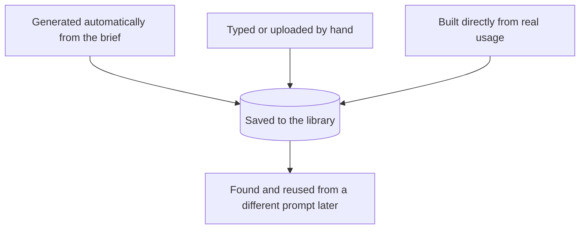

# Libraries: Reusable Checks and Test Sets, Built From Real Data Too

**Worth being blunt about where we're actually starting from: none of this exists today.** Today there's a library for *prompts* (browse projects and versions, manage who has access) — and that's it. There is no equivalent library for checks or test sets at all; they live buried inside each individual prompt's own configuration, not as their own reusable, searchable things. Even the prompt library that does exist has no semantic search — finding something means already knowing its name. Everything in this doc, not just the real-usage piece, is new.

Checks and test sets shouldn't be one-off things you build fresh for a single prompt and never look at again — they should live in a shared library that any prompt can pull from, and that any prompt can also contribute back to, the same way a prompt library already works today. This doc covers how things actually get *into* that new library, especially from real usage, not just how they'd get reused once they're there.

## Three ways something ends up in the library

- **Generated automatically**, as part of drafting a brand-new prompt or updating one — covered in [02-launching-a-brand-new-prompt.md](02-launching-a-brand-new-prompt.md) and [03-updating-an-existing-prompt.md](03-updating-an-existing-prompt.md). This path, and what happens to a check or test case once it exists, is already reasonably well specified by the rest of this playbook.
- **Typed or uploaded by hand**, the more direct authoring path, also already covered by the rest of this playbook's iteration loop.
- **Built directly from real usage** — this is the path with the least design behind it so far, and the focus of the rest of this doc.

All three should land in the same place and work the same way once they exist: named, described, taggable, searchable, and reusable from any other prompt's workspace — including proper search that finds "something like a tone check" without already knowing what it's called, which the current prompt library doesn't have either. The remaining open question isn't what happens *after* something is saved — the rest of this playbook already answers that reasonably well. It's how real data gets *in* in the first place, which today has no path at all.

## The gap: even in the new design so far, real data only gets in one row at a time, and only after something already went wrong

As proposed so far, the only way a real customer interaction becomes a permanent test case is through the feedback loop in [05-continuous-quality-and-feedback-loop.md](05-continuous-quality-and-feedback-loop.md): someone reviews real usage, notices a pattern, and promotes *that specific case* into the test set. That's a real improvement over today (where there's no path for this at all), but it has two limits worth calling out plainly:

- It only ever happens **one case at a time**, driven by someone manually spotting something during a review.
- It only ever gets triggered **reactively**, after a review turns something up — there's no way to just go looking for good real examples proactively, on your own schedule, without a specific incident to justify it.

Building a solid test set out of fifty real support tickets, or a hundred real conversations, shouldn't require fifty or a hundred separate "I noticed this while reviewing" moments.

## How this should work instead

1. **Open a browse view of real usage, any time, for any reason.** Filter by date, by which prompt produced it, by whether it already passed or failed a check (if anything happened to grade it), or by tag. No specific incident or review finding is required to open this — it should be as available as browsing the library itself.
2. **Personal or sensitive details are scrubbed automatically before anything here can be saved permanently** — the same rule that already applies when promoting a single case in the continuous-feedback loop. A real interaction clears out on its own after a short window; a permanent test case doesn't, so nothing raw gets saved for good without being cleaned up first.
3. **Select any number of real examples and add them to a test set in one action.** Building a test set from fifty real cases should be one step, not fifty individual "promote this" clicks.
4. **The same real examples can become more than test rows.** A real case is also a natural way to write a new check ("this exact situation should always pass this rule") or to spot-check an automated grader against real judgment — not just to grow the test set.
5. **Once built this way, it's saved to the library exactly like anything else** — same naming, tagging, and reuse from other prompts described above. Nothing extra is needed here; the only thing that needed fixing was how real data gets in.

## Who does this

This is part of day-to-day testing, not a separate specialty — it sits with whoever owns the test loop day to day (see [04-roles-responsibilities-and-approvals.md](04-roles-responsibilities-and-approvals.md)), the same person already reading real outputs in the continuous-feedback loop. The brief owner isn't expected to be hands-on here; they see the results of it, the same way they see everything else that comes out of testing.

## The short version

None of this exists today — there's a library for prompts and nothing else, no semantic search even there. Building it means three things need a way in: generating from a brief, typing things by hand, and real usage — the first two are already reasonably well covered by the rest of this playbook's flow. What still needs its own, always-available action — not just a byproduct of noticing a problem during review — is browsing real usage directly and turning a batch of it into test cases (or checks, or grader spot-checks) in one step, with the same privacy scrubbing applied either way. Once it's in the library, it should be reusable everywhere, the same way the prompt library already lets you reuse a prompt today.
