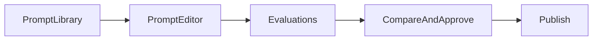

# Overview

## What Prompt Management is

Prompt Management is a web application for creating, versioning, testing, evaluating, approving, and publishing AI prompts. Teams use it to develop prompts collaboratively, run them against models, validate quality with evaluations, and release approved versions for production use.

The application is organized around **prompt projects**. Each project contains one or more **versions**. A version is a saved snapshot of prompt content, model settings, and related metadata.

## Main surfaces

| Surface | Route | Purpose |
|---|---|---|
| **Prompt Library** | `/library` | Browse projects and versions; create projects; manage access |
| **Prompt Editor** | `/editor`, `/editor/:projectId/:versionId` | Create and edit prompt content, model config, and variables |
| **Evaluations** | `/evaluation/:projectId/:versionId` | Configure and run evaluations for a version |
| **Compare** | `/compare` | Run multiple prompts side by side |
| **Batch Processing** | `/batch-processing` | Standalone batch jobs over spreadsheet inputs |
| **Model Catalog** | `/models` | Browse and manage models, aliases, redirect rules |
| **Chat** | `/`, `/chat/:chatId?` | General chat playground (not tied to saved projects) |
| **Settings** | `/settings` | Admin-only LiteLLM and redirect rule controls |

See [Feature Catalog](05-feature-catalog.md) for details on surfaces outside the core lifecycle.

## Roles

| Role | Typical responsibilities |
|---|---|
| **Creator** | Creates projects and versions, edits prompt content and config, runs Submit, sets up evaluations, marks a final eval config |
| **Reviewer/Approver** | Reviews version changes in compare mode, approves versions they did not create, publishes approved versions |
| **Admin** | Manages models, redirect rules, LiteLLM settings; bypasses project permission checks; accesses Settings |

A single person may act as both Creator and Approver on different versions, but **cannot approve a version they created**.

## Access model

Permissions are set **per project**.

| Access level | What the user can do |
|---|---|
| **Read** | View project and version content, run evaluations (create configs in some cases), view eval runs |
| **Full** | Edit prompt content, save new versions, run Submit, manage tags, approve/publish (if not the creator), set Testing flag |
| **Manage Access** | Change who has Read or Full access on the project (requires strict Full access or Admin) |

Additional access rules:

- **Everyone** checkboxes in Manage Access can grant Read or Full access to all authenticated users.
- **Public / Private** is chosen when a project is first created. Public projects grant Read access to everyone automatically.
- **Admin** users (`PromptStudioAdmin`) bypass project permission checks.
- **Settings** (`/settings`) is available only to Admin users.

## Glossary

| Term | Meaning |
|---|---|
| **Project** | Named container for prompt versions |
| **Version** | Saved snapshot of prompt content and model settings |
| **Save as new version** | Creates a new version from current edits |
| **Submit** | Run the prompt against a model (single run or batch over spreadsheet rows) |
| **Configuration** | Evaluation setup for a version (dataset, assertions, model settings) |
| **Final configuration** | The one eval config designated as the release gate for approval |
| **Evaluation Run** | Executed evaluation job with pass/fail results |
| **Evolution** | Automated prompt improvement run |
| **Online Evaluation** | Evaluation over production traces |
| **Eval relevancy** | Score measuring how well an eval config matches the prompt |
| **Approve** | Reviewer confirms the version is ready for production release |
| **Publish** | Release an approved version for production use |
| **Testing** | Flag a version for pre-production retrieval via API |
| **Tags** | Labels on a project (e.g. `SkipApprovalGate` bypasses approval validation) |
| **Latest published** | The most recently published version in a project |

## Lifecycle at a glance

The detailed journey is in [Prompt Development Lifecycle](02-prompt-development-lifecycle.md).

## Relevant source areas

- Routes and navigation: `PromptManagementWebApp/Src/promptmanagementwebapp.client/src/Router.tsx`, `routes.ts`, `layout/Tabs.tsx`
- Access UI: `promptLibrary/AccessManagementModal.tsx`
- Permission API: `PromptManagementApi/.../Controllers/v3/PermissionController.cs`
