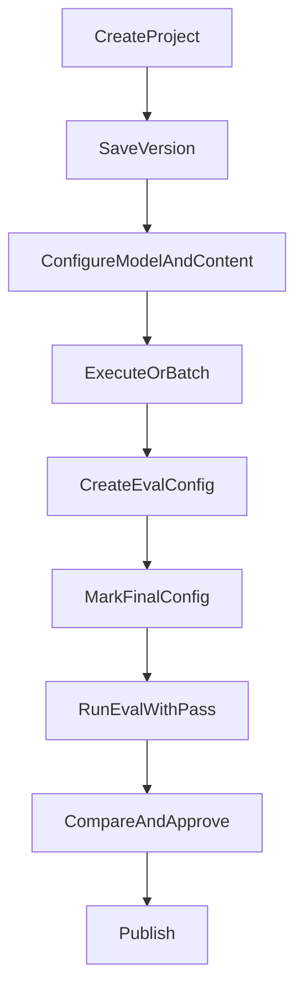
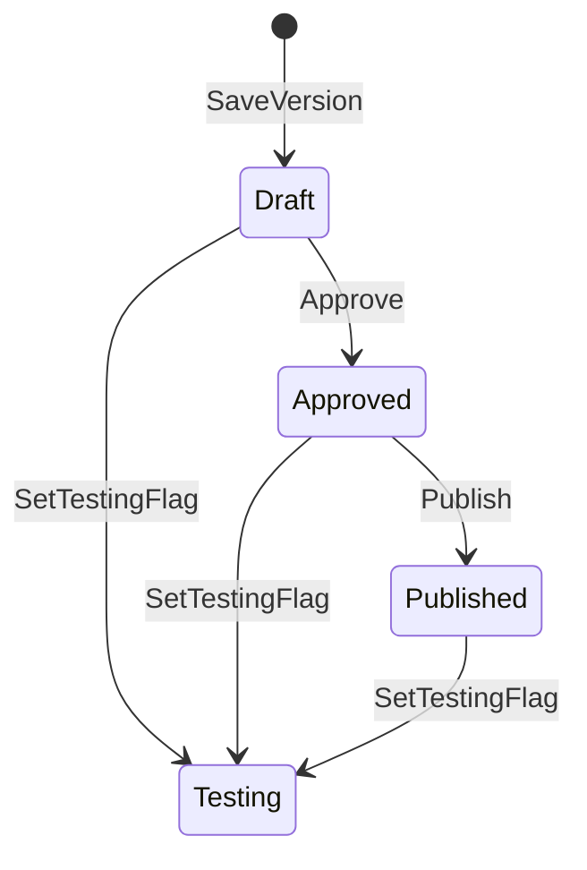

# Prompt Development Lifecycle

This is the primary document for understanding how a prompt moves from creation to publish. Evaluations and approval details are expanded in [Evaluations](03-evaluations.md) and [Approvals and Publishing](04-approvals-and-publishing.md).

## Lifecycle flow

---

## 1. Discover and open a project

**Role:** Creator, Reviewer, or any user with Read access

**Where:** Prompt Library (`/library`)

**What the user does:**
- Browse the project table (projects expand to show versions)
- Click a row to open the Prompt Editor for that project/version
- Use **Create new project** to start a new prompt

**What the user sees:**
- Project name, description, tags, last modified info
- Version rows with status indicators
- **Latest published** highlighted on the current published version
- **Used (30d)** usage summary per project/version

**Current rules:**
- Read access is required to view a project
- Full access is required to edit
- Manage Access is available only when the user has permission to edit project permissions

**Version actions from library:**
- **Copy link** — share editor URL
- **Start batch processing** — launch batch from a saved version
- **Delete version** — soft-delete; disabled for the latest published version
- **Manage access** — open permission dialog (project rows only)

---

## 2. Create a project and first version

**Role:** Creator (requires Full access after project exists)

**Where:** Prompt Editor (`/editor` for new, `/editor/:projectId/:versionId` after save)

**What the user does:**
- Enter **Project Name** (required)
- Enter project description: “What is this project about?”
- Choose **Public** or **Private** (only at creation)
- Write prompt content and model settings
- Click **Save as new version**

**What happens:**
- A new project and an initial version (“Initial version”) are created
- URL updates to the saved project/version IDs
- Success notification confirms the save

**Current rules:**
- Project name is required and must be unique
- Public/Private is set only at creation — there is no later toggle in Edit Project
- Creator is automatically granted Full access on the new project
- Public projects grant Read access to everyone
- Prompt messages must have non-empty roles; invalid JSON is rejected
- If the model is an alias (no `/` in model name), an **Alias Usage Warning** appears before save

**Uncertain behavior:**
- The service type selector (e.g. GenAiApi) is visible only for new projects in code view. Projects using other service types may not be editable in the current UI.

---

## 3. Edit prompt content and configuration

**Role:** Creator (Full access)

**Where:** Prompt Editor

**What the user does:**
- Edit prompt messages in **toolbox** (visual) or **code** (JSON) view
- Open the **Config** gear to set model, temperature, max tokens, response format, and other parameters
- Add **Functions (tool calling)** or **Structured output** as needed
- Add or remove **Tags** on the project
- Switch versions via the `v:` dropdown in the action bar
- Edit project name/description via **Edit project details**

**Version switching:**
- Dropdown shows `{versionNumber}: {description}`
- Status line shows **Approved** or **Published** with user and date
- Options may show **(latest published)**

**Current rules:**
- Full access required to save, edit tags, or modify content
- Published versions remain editable — saving creates a **new version**, not an in-place change
- Unsaved changes trigger a confirmation when navigating away
- Model change with logit bias may require a recalculation confirmation

**Uncertain behavior:**
- Final eval configurations lock after publish, but prompt content itself does not lock on published versions.

---

## 4. Save a new version

**Role:** Creator (Full access)

**Where:** Prompt Editor action bar

**What the user does:**
- Update the version description: “What has changed since previous version?”
- Click **Save as new version**

**What happens:**
- A new version is created with the current content and config
- Version history updates; user is moved to the new version

**Alternative — Revert:**
- When viewing an older unmodified version, **Revert to this version** recreates content from that historical snapshot as a new save path

**Current rules:**
- Version description is required on save
- Each save creates an immutable new version (previous versions are preserved)
- Duplicate project names are rejected

---

## 5. Execute and test the prompt

**Role:** Creator (Full access)

**Where:** Prompt Editor — **Submit** button and Output panel

**What the user does:**
- Click **Submit** to run the prompt against the configured model
- Optionally upload a spreadsheet (CSV/XLSX) and run over selected rows
- Use **Run with variables** for manual variable input
- From the Submit menu: **Start batch processing**, **Add to Comparison**

**What the user sees:**
- Output panel shows loading, success (with optional token/cost info), or error
- Batch results can sync back to the uploaded file
- “This version was requested N time(s)” usage counter in the action bar

**Current rules:**
- Prompt must be saved before batch processing, comparison, or eval-linked runs
- Executing the prompt (Submit or eval run) marks the version as **executed**, which is required for approval unless `SkipApprovalGate` applies
- Batch over ≥500 selected rows triggers a confirmation dialog
- Full access required to sync batch results back to the uploaded file

**See also:** [Evaluations](03-evaluations.md) for running the prompt through eval configurations.

---

## 6. Compare versions before approval

**Role:** Reviewer/Approver (Full access)

**Where:** Prompt Editor — **Compare & Approve** / **Compare**

**What the user does:**
- Click **Compare & Approve** to enter comparison mode
- Review side-by-side or inline diff of the active version vs a reference (default: latest published or previous version)
- After approval, the button label changes to **Compare**

**Current rules:**
- The **Approve** button is shown only when the user is in comparison mode **or** the version is already approved (then the button reads **Publish**)
- First-time approval typically requires entering **Compare & Approve** mode — the Approve button is hidden outside compare mode for unapproved versions

**Uncertain behavior:**
- This compare-mode requirement for first Approve is easy to miss; users may not see the Approve button until they enter compare mode.

---

## 7. Approve the version

**Role:** Reviewer/Approver (Full access, not the version creator)

**Where:** Prompt Editor — **Approve** button (visible in compare mode or after prior approval)

**What the user does:**
- Click **Approve**
- Review the **Approve Prompt Validation** dialog (checks final config, successful test, execution)
- Confirm in the **Confirm Approval** dialog

**What happens:**
- Version status becomes **Approved** (shown in version dropdown with approver and date)
- Version is not yet available for production — publish is a separate step

**Current rules:**
- Creator cannot approve their own version (button disabled; tooltip explains)
- All three validation checks must pass unless the project has the `SkipApprovalGate` tag
- Eval relevancy must succeed before approval completes (unless SkipApprovalGate)
- See [Approvals and Publishing](04-approvals-and-publishing.md) for full gate details

---

## 8. Publish the version

**Role:** Reviewer/Approver or Creator with Full access (after approval)

**Where:** Prompt Editor — **Publish** button (shown when version is already approved)

**What the user does:**
- Click **Publish** (same button location as Approve, relabeled)
- Review validation dialog again
- Confirm in the **Confirm Publish** dialog

**What happens:**
- Version status becomes **Published**
- Success toast: “Prompt version published!”
- Approve/Publish controls hide; **Testing** checkbox remains

**Current rules:**
- Version must be approved before publish
- Publish makes the version available for production use via the published-version API
- There is no separate “Deploy” UI — publish is the release step
- Only one published version is “latest published” at a time per project (superseded when a newer version is published)

**Lifecycle ends here.** This documentation does not cover how downstream applications consume published versions.

---

## 9. Testing flag (parallel to approval/publish)

**Role:** Creator or Reviewer (Full access)

**Where:** Prompt Editor — **Testing** checkbox

**What the user does:**
- Toggle **Testing** on or off for any version (including published)

**What it means:**
- Pre-production applications using the testing-version API retrieve this version
- Independent of Approve/Publish state

**Current rules:**
- Can be changed without going through approval validation
- Persists through approve and publish actions

---

## Version states summary

| State | Visible indicator | Meaning |
|---|---|---|
| Draft | No approval/publish label | Saved but not approved |
| Approved | **Approved** with user and date | Reviewer signed off; ready to publish |
| Published | **Published** with user and date | Released for production |
| Testing | **Testing** checkbox checked | Available for pre-production API |
| Latest published | **(latest published)** in dropdown | Current production release |

---

## Relevant source areas

- Library: `promptLibrary/PromptLibraryTable.tsx`, `promptLibraryColumnsDefinitions.tsx`
- Editor and save: `promptEditor/PromptEditor.tsx`, `promptEditor/ActionBar.tsx`, `promptEditor/Editor.tsx`, `config/Config.tsx`
- Execute: `promptEditor/Submit.tsx`, `promptEditor/Output.tsx`
- Version history: `promptEditor/ActiveProjectHistoryDropdown.tsx`
- Compare: `promptEditor/VersionComparisonControls.tsx`, `promptEditor/VersionDiffViewer.tsx`
- Approval UI: `promptEditor/ApprovalSection.tsx`, `promptEditor/ApprovalValidationDialog.tsx`
