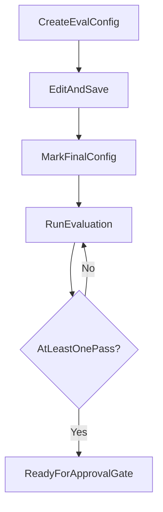

# Evaluations

Evaluations validate prompt quality before approval and publish. They are configured and run from the **Evaluations** page, reached via the **Evals** button in the Prompt Editor (requires a saved project).

**Route:** `/evaluation/:projectId/:versionId`

See also: [Prompt Development Lifecycle](02-prompt-development-lifecycle.md) and [Approvals and Publishing](04-approvals-and-publishing.md).

---

## Page layout

Three panes:

| Pane | Label | Purpose |
|---|---|---|
| Left | **Configurations** | List and create eval configs for this version |
| Center | Config editor | Edit the selected configuration |
| Right | **Evaluation Runs** | View run history and results |

---

## Create an evaluation configuration

**Role:** Creator (requires Full access on the project; tooltip states “full permission”)

**What the user does:**
- Click **+ New Config**
- Choose to copy from an existing config or start from a template
- Name the configuration (unique per version)

**Current rules:**
- Project must be saved before the Evals page is accessible
- Configuration name must be unique within the version
- Users with Read access can create configs in some API paths, but the UI requires Full access for **+ New Config**

**Uncertain behavior:**
- Eval config create/update permissions in the API are weaker than prompt edit permissions (Read may suffice for some API operations).

---

## Edit a configuration

**Role:** Creator (Full access)

**What the user does:**
- Select a configuration from the left pane
- Edit in **Form editor** or **YAML editor** mode
- Configure:
  - **Description**
  - **Prompt source** (which prompt/version the eval targets)
  - LLM provider settings
  - **Dataset / test cases**
  - **Assertions** (pass/fail criteria)
- Click **Save** or **Cancel**

**AI-assisted features (when available):**
- YAML autocorrect
- Dataset generation
- Requirement extraction
- Relevancy calculation
- Prompt evolution suggestions

**Current rules:**
- Config must be saved before a run can be started
- Saving resets the eval relevancy score to zero
- Warnings appear for prompt target mismatch, missing required variables, or advanced config issues
- Unsaved changes trigger a navigation guard

---

## Mark a final configuration

**Role:** Creator (Full access)

**What the user does:**
- Click the shield icon on a configuration to mark it as **Final configuration**

**What it means:**
- One config per version is designated as the release gate
- Approval validation requires a final config unless `SkipApprovalGate` applies

**Current rules:**
- At least one final configuration is required before approval
- Final configuration cannot be changed after the version is **published**
- Tooltip: “You must have at least one final configuration before prompt publishing.”

**Uncertain behavior:**
- Exclusive final-flag enforcement (only one final per version) likely happens in the database; this is not visible in application code.

---

## Run an evaluation

**Role:** Creator (Full access)

**What the user does:**
- From the config editor run menu, choose:
  - **Evaluation** — standard eval run (PromptFoo)
  - **Evolution** — automated prompt improvement
  - **Online Evaluation** — eval over production traces
- For Evaluation: choose **Store** or **Run Only** in the share dialog
- Save the config first if it has not been saved

**What happens:**
- Run appears in **Evaluation Runs** with status updates (polled every 15 seconds while in progress)
- Completing an eval run may mark the version as **executed** (counts toward approval gate)

**Run statuses (user-visible):**

| Status | Meaning |
|---|---|
| Complete | Finished; shows pass % and Passed/Total |
| In Queue | Waiting to start; can **Cancel run** |
| In Progress / Pending / Fetching traces / Redacting | Active processing |
| Error | Failed; error dialog with summary |
| Cancelled | User or system cancelled |
| No traces found | Online eval found no matching traces |

**Current rules:**
- Evaluation run on the final config must complete with at least one passing test case for approval (unless SkipApprovalGate)
- Online eval: max 250 traces, time window ≤ 7 days, end time must be in the past
- Evolution runs link to improved prompt results when complete

---

## Eval relevancy

**Role:** Creator or Reviewer

**What it is:**
- A score (0–1) measuring how well the eval configuration matches the prompt
- Calculated via an LLM-as-judge prompt

**What the user does:**
- Click **Calculate** or **View details** on the relevancy chip
- Relevancy is also checked automatically when attempting approval

**Current rules:**
- Relevancy must succeed (valid LLM response with score) before approval completes
- Skipped when the project has the `SkipApprovalGate` tag
- If the config already has a score > 0, recalculation is skipped
- No minimum score threshold is enforced — only that the relevancy call succeeds

**Uncertain behavior:**
- Relevancy depends on a configured managed prompt project; if unset, behavior may fail or require manual intervention.

---

## Evaluation types

### Standard evaluation
- Runs test cases from the dataset against the prompt
- Results show pass rate and link to PromptFoo for details

### Evolution
- Attempts automated prompt improvement
- On completion, shows score and improvement; links to result in editor

### Online evaluation
- Fetches production traces, redacts PII, then runs eval pipeline
- Tagged **(online)** in the runs list
- Background processing: FetchingTraces → Redacting → InQueue → Jenkins

---

## How evaluations connect to approval

Before **Approve**, these eval-related checks must pass (unless `SkipApprovalGate`):

| Check | Requirement |
|---|---|
| **Final Configuration** | At least one config marked final on this version |
| **Successful Test Case** | Final config has a completed run with ≥1 passing test |
| **Prompt Version Execution** | Version executed via Submit or Evals |

See [Approvals and Publishing](04-approvals-and-publishing.md) for the full approval flow.

---

## Relevant source areas

- Evaluations UI: `evals/EvalsPage.tsx`, `evals/ConfiguratoinListSection.tsx`, `evals/ConfigurationEditorSection/`, `evals/ConfigurationRunsSection.tsx`
- Eval API: `PromptManagementApi/.../Controllers/v3/PromptEvalConfigurationController.cs`, `PromptEvalRunController.cs`, `OnlineEvalRunController.cs`
- Relevancy: `PromptManagementApi/.../Features/Evals/Commands/Relevancy/CalculateEvalRelevancyCommandHandler.cs`
- Approval validation: `PromptManagementApi/.../Features/PromptApprovals/Commands/ValidatePromptForApproval/ValidatePromptForApprovalCommandHandler.cs`
