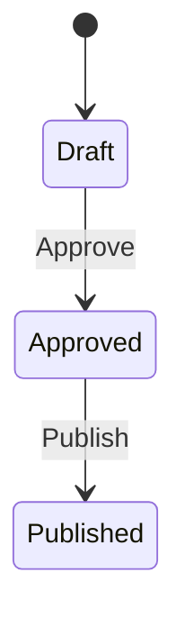

# Approvals and Publishing

Approval and publishing are two sequential steps that release a prompt version. There is no separate “Deploy” screen — **Publish** is the production release action.

See also: [Prompt Development Lifecycle](02-prompt-development-lifecycle.md) and [Evaluations](03-evaluations.md).

---

## Two-step release model

| Step | Button label | Who | Outcome |
|---|---|---|---|
| **Approve** | Approve | Reviewer (not the creator) | Version is signed off; not yet in production |
| **Publish** | Publish | User with Full access | Version is released for production use |

Both steps use the same button location; the label changes after approval.

---

## Who can approve and publish

**Role:** Reviewer/Approver with **Full** project access

**Current rules:**
- Creator **cannot approve** a version they created (button disabled; tooltip: “You cannot approve version that you created.”)
- Exception: internal/agent users with empty or “Internal User” username may bypass self-approval block
- Full access required for both Approve and Publish actions
- Admin users bypass project permission checks

---

## Where approval happens in the UI

**Where:** Prompt Editor action bar

**Visibility rules:**
- **Approve** button appears only when:
  - Version is **not published**, AND
  - User is in **comparison mode** OR version is **already approved** (then button reads **Publish**)
- **Testing** checkbox is always visible when user has Full access

**Uncertain behavior:**
- First-time Approve is hidden until the user enters **Compare & Approve** mode. This is a common UX gap — users may not find the Approve button without comparing first.

---

## Approval validation gates

When the user clicks **Approve** or **Publish**, the **Approve Prompt Validation** / **Publish Prompt Validation** dialog runs three checks:

| Check | Valid when | Invalid message |
|---|---|---|
| **Final Configuration** | At least one eval config marked final on this version | “Select a Final eval configuration in the Evals tab, under Configurations.” |
| **Successful Test Case** | Final config has a completed eval run with ≥1 passing test | “Run the Final configuration and confirm it has at least one passing test case. See results in Evaluation Runs.” |
| **Prompt Version Execution** | Version has been executed (Submit or Evals) | “Execute this prompt version at least once, either by clicking Submit in the Prompt Editor or by running it through Evals.” |

Each check shows a chip: **Valid**, **Invalid**, or **Skipped**.

**Current rules:**
- All three must be **Valid** to proceed (unless SkipApprovalGate)
- Validation runs again on Publish, not only on first Approve
- After validation passes, a confirmation dialog appears before the action completes

---

## Eval relevancy gate

Before approval completes, the system calculates **eval relevancy** on the final configuration.

**Current rules:**
- Relevancy must return a successful result (valid 0–1 score from LLM-as-judge)
- Skipped when `SkipApprovalGate` tag is present
- If config already has score > 0, recalculation is skipped
- No minimum score threshold — only success/failure of the relevancy call matters
- Failure returns HTTP 422 and blocks approval

---

## SkipApprovalGate

**What it is:** A project **tag** named `SkipApprovalGate`

**How it is applied:**
- Added via project Tags in the Prompt Editor (no dedicated UI control for this tag name)
- Must be added manually as a tag value

**What it changes:**
- All three validation checks show **Skipped** instead of Valid/Invalid
- Eval relevancy check is skipped
- Approve and Publish still required — the tag bypasses validation, not the approval workflow itself

**Side effect (production only):**
- When a version with SkipApprovalGate is published, an email notification may be sent to the version creator

---

## Confirm dialogs

After validation passes:

| Action | Dialog title | Message summary |
|---|---|---|
| Approve | Confirm Approval | Version will be approved; author or collaborator can then publish |
| Publish | Confirm Publish | Version will be available for production; latest published API will return this version until superseded |

Success toasts:
- “Prompt version approved!”
- “Prompt version published!”

---

## Testing flag

**Where:** **Testing** checkbox in the action bar (alongside Approve/Publish)

**What it does:**
- Marks the version for pre-production retrieval via the testing-version API
- Can be toggled independently of Approve/Publish
- Does not trigger validation gates

**Current rules:**
- Available on any version including published
- After publish, Approve/Publish buttons hide but Testing remains
- Tooltip explains pre-production API behavior

---

## Published version behavior

**What changes after publish:**
- Version shows **Published** status with publisher and date
- Approve/Publish buttons are hidden
- Final eval configuration is locked (cannot be changed)
- Version becomes **latest published** until a newer version is published

**Current rules:**
- Publish is immutable — approval and publish timestamps cannot be overwritten
- Soft-delete is disabled for the latest published version in the library
- Prompt content on published versions can still be edited by saving a **new version** (does not modify the published version in place)

---

## Approval gate for consumers (background rule)

Versions created on or after a configured cutoff date require publish before they are visible to most consuming applications. This affects what downstream apps see but is not part of the in-app user workflow documented here.

**Gates labeled:**
- **Config:** `ApprovalGateActivationTime` (default 2025-12-01) — versions before cutoff are grandfathered
- **Config:** `BypassApprovalApps` — whitelisted apps (via AppId header) can access unpublished/latest versions
- **Environment:** production vs non-production auth behavior

This documentation stops at Publish and does not describe downstream consumption in detail.

---

## Relevant source areas

- Approval UI: `promptEditor/ApprovalSection.tsx`, `promptEditor/ApprovalValidationDialog.tsx`
- Approval API: `PromptManagementApi/.../Controllers/v3/PromptApprovalController.cs`
- Validation handler: `PromptManagementApi/.../Features/PromptApprovals/Commands/ValidatePromptForApproval/ValidatePromptForApprovalCommandHandler.cs`
- Approval upsert: `PromptManagementApi/.../Features/Prompt/Commands/UpsertPromptVersionApproval/UpsertPromptVersionApprovalCommandHandler.cs`
- Relevancy: `PromptManagementApi/.../Features/Evals/Commands/Relevancy/CalculateEvalRelevancyCommandHandler.cs`
- Tag enum: `PromptManagementApi/.../Domain/Enums/TagEnum.cs`
