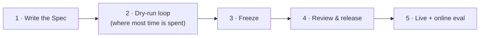
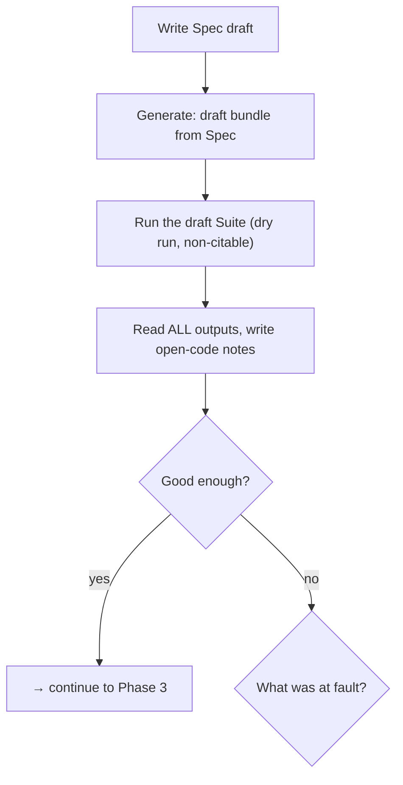
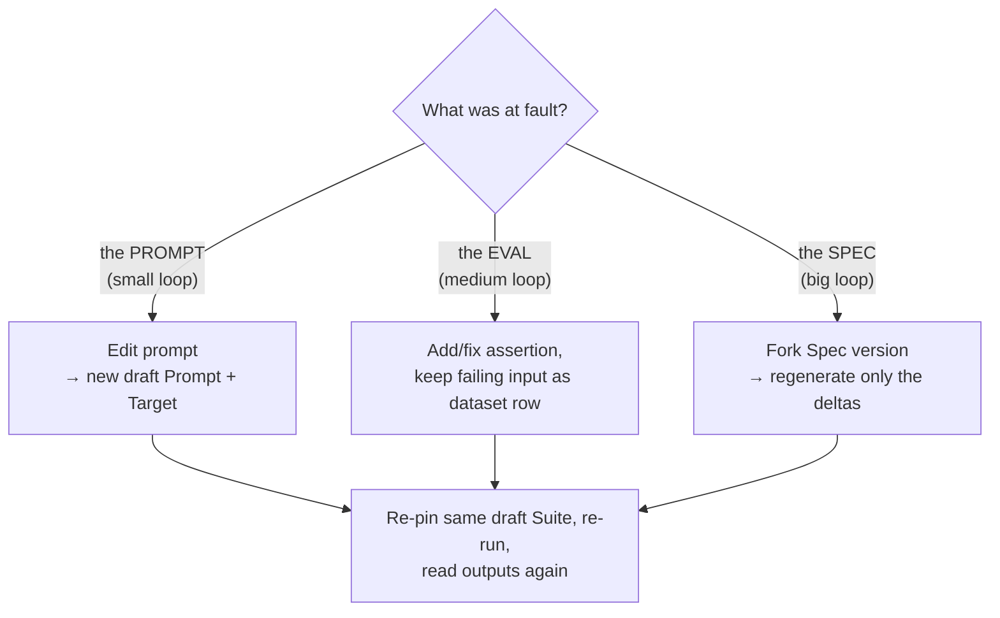
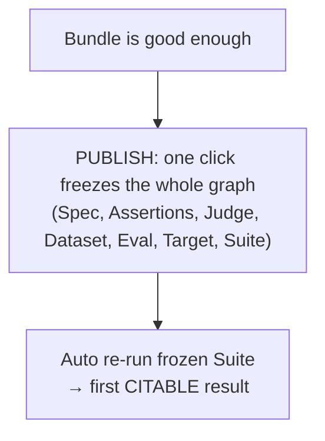
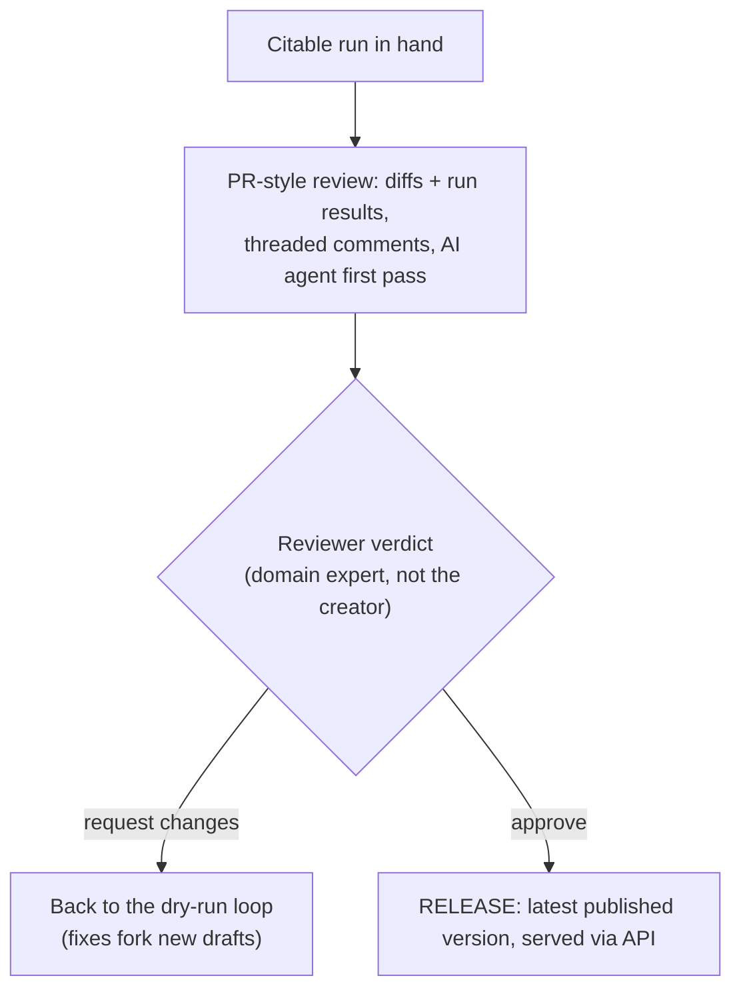
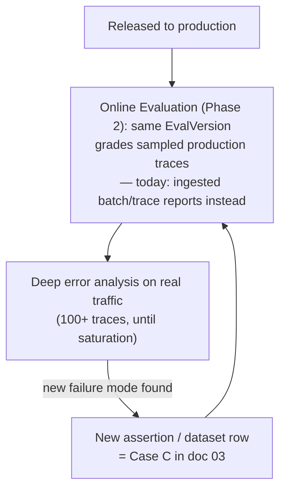

# Case 1 — Starting Anew: New Spec, New Prompt Version

This is the flow for a brand-new prompt with no prior version, no prior spec, and no prior eval history.

The flow has five phases. First the whole journey at a glance — five stops, left to right:



Each phase is a small diagram of its own below. Read them in order — the last node of each phase is the first node of the next.

### Phase 1-2 · Write the Spec, generate the bundle, iterate

After **Write Spec draft** comes one system action — **Generate** — which drafts everything at once (prompt, assertions, judge, dataset of seeds + a small synthetic batch, eval, suite), runs it, and drops you into the loop:



The **"what was at fault?"** diagnosis has three answers, each a differently-sized loop back:



**A note on diagnosing "the EVAL was at fault" — keep this loop narrow.** Evals should map tightly to the Spec's own constraints and be generated directly from it, so when a dry run fails, the more common diagnosis is one of the other two: the **prompt** didn't fully implement a correct, well-specified requirement (small loop), or the **Spec** itself was too loose or incomplete to have specified the right behavior in the first place (big loop) — a real eval failure like this is a signal the system (prompt or Spec) needs to improve, not that the eval is wrong. The **EVAL** loop is for a genuinely narrower case: the Spec's intent is correct and clear, but the *generated check is a bad encoding of it* — e.g., a `code_assertion` picked the wrong check type, a regex is mis-scoped, a `rubric_grading` rubric asks the judge the wrong question. That's a bug in the check's implementation, not a disagreement about what should be checked. Before reaching for "fix the eval," first rule out that the real fault is the prompt or the Spec — this is what keeps the eval trustworthy instead of it quietly being bent to match whatever the prompt currently does.

### Phase 3 · Freeze and verify



### Phase 4 · Review and release



**Phase 3 vs. Phase 4 — what's automatic and what's reviewed.** Phase 3 is fully system-driven and mechanical: once the author judges the dry-run bundle "good enough," Publish freezes the graph and the system re-runs it automatically to produce the first citable result — no human review happens inside Phase 3 itself. Phase 4 is where a human (with an AI agent's first pass) actually looks at that frozen bundle and decides whether it's fit to release. That review isn't only about polishing this one bundle: a recurring problem spotted at Phase 4 — the generator keeps picking the wrong assertion type for a certain kind of criterion, or Spec drafts keep omitting the output contract — is a signal to fix the **generation mechanism itself** (the dry-run generator, the curated assertion set, the Spec template), not just this one case. Treat Phase 4 findings as feeding two things: this bundle's approve/reject decision, and the standing backlog of "make the system produce better first drafts."

### Phase 5 · Live — and the loop that never ends

**Phasing note:** the *Eval Service SDD* marks Online Evaluation as **Phase 2 — the model supports it, but no executor is built yet** (see [06](06-sdd-alignment-and-resolutions.md)). (Per team naming feedback, this proposal now calls the system the **Evals Platform** going forward; the underlying SDD document keeps its original title, *Eval Service SDD*.) The diagram below is the target state once that ships. Until then, substitute "**ingested** batch/trace reports" for "Online Evaluation" — same loop, more manual sourcing.



**The one-sentence version:** write the brief, let the system draft everything, spend your real time in the read-outputs-and-fix loop (prompt fix = small, eval fix = medium, spec fix = big), freeze it all in one click, get a citable run, review it like a pull request, release — and then production traffic keeps teaching the eval new tricks forever.

## Step by step

### 1. Write the Spec

**Where:** A new "Spec" workspace, entered from the Prompt Library the same way "Create new project" works today.

**What the user does:**
- Fill in goal, input/output contract, guardrails, success criteria, and a handful of examples/edge cases (see field list in [01](01-concepts-and-entity-mapping.md)).
- Optionally use an AI assistant to draft the Spec from a pasted product brief or a short conversation — this replaces today's external "Build Prompt with Agent" deep link with an in-product step that produces a structured artifact instead of just a finished prompt.
- Save. The Spec is now a `SpecVersion` in **draft**.

**Recommendation:** keep most Spec fields optional so a thin spec is still draftable — richness can come from iteration, not an upfront form wall — but require **Name**, **at least one success criterion**, and the **Input contract** + **Output contract**. Per review feedback, those two are the fields the rest of the bundle genuinely can't be safely drafted without: the Input contract says exactly what gets fed to the LLM (which may be a single string, or a collection of named variables of different types — not always freeform text), and the Output contract says how the response must be shaped (free text, or a JSON schema with a set of required fields) — both the Prompt and its structural `code_assertion` checks depend directly on knowing these upfront. A minimal Spec is still just Name + 1 criterion + a concrete input/output shape, e.g.:

```json
{
  "inputs": [
    {
      "name": "text",
      "type": "string",
      "description": "The source text to be summarized. May be in any language. May be a paragraph, article excerpt, document, email, log entry, or any passage of natural language.",
      "required": true
    }
  ],
  "output": [
    {
      "name": "summary",
      "type": "string",
      "description": "A concise English summary of the input text, at most 3 sentences. Does not introduce information absent from the source. Contains no meta-commentary about the summarization process.",
      "required": true
    }
  ]
}
```

See [01](01-concepts-and-entity-mapping.md) for the full field list and how each maps onto downstream entities.

### 2. Dry run — generate the whole bundle

**What happens (system-driven, single action, e.g. a "Generate" button):**

Using the mapping table in [01-concepts-and-entity-mapping.md](01-concepts-and-entity-mapping.md), the system drafts in one pass:

- A **Prompt version** (content + model config) satisfying the goal/output contract/guardrails.
- One **Assertion version** per success criterion and guardrail (draft), using `rubric_grading` or `code_assertion` as appropriate. Per review feedback, the curated set isn't an abstract engineer-defined list floating on its own — it should map directly onto the **existing promptfoo assertions library** (contains/excludes, regex, valid-JSON, JSON-schema, field-in-range, tool-was-called, etc.), so the generator is picking from and parameterizing checks that already exist and are already trusted, rather than inventing a parallel taxonomy. The generator's real job is **detecting the opportunity** to check something deterministically, not writing the code — LLMs are already good at the latter. So the order is: (1) try to map the criterion onto an existing promptfoo assertion type first; (2) only if nothing in that library fits, let the generator write a small custom check itself — flagged for the AI review agent to look at in step 8, per [06](06-sdd-alignment-and-resolutions.md)'s security note that `code_assertion` content executes on the runner with the runner's permissions, so freeform generated code shouldn't pass through silently; (3) a check that's too novel or risky even for that becomes a request to an engineer to add a new curated type instead. A criterion that fits none of the code tiers falls back to `rubric_grading`.
- A default **Judge Policy version** (draft) — a Judge Policy is simply a rubric + model/grading-settings combination (see [01](01-concepts-and-entity-mapping.md)) — reused from a library default unless the Spec specifies a grading preference. If the Spec doesn't state a preferred model or grading rule, the system falls back to a default Judge Policy stored in the shared library; that library is exactly the "place" those defaults live, not a separate concept.
- An **Eval version** (draft) bundling those assertions + judge + a suggested aggregation rule (`all_pass` by default; `weighted` if criteria clearly differ in importance).
- A **Dataset version** (draft) with `DatasetItem` rows seeded from the Spec's examples and edge cases, plus a few synthetic rows generated to broaden coverage.
- A **Target version** (draft) wrapping the drafted Prompt version.
- A **Suite version** (draft) pinning Eval + Dataset + Target + the default Skeleton.

Every generated version is linked back to the Spec version via the provenance join table from [01](01-concepts-and-entity-mapping.md), so the UI can always answer "why does this exist."

### 3. Auto-launch the dry run

The system immediately launches the draft Suite as a **batch RunGroup**. Because every pinned version is still draft, this run is **non-citable** by definition — that's fine, its only job is to show the author, within seconds of writing the spec, whether the freshly drafted prompt already clears the bar it was written against.

**What the user sees:** a unified **Results** pane — pass rate, per-assertion breakdown, per-row output, cost/latency/tokens — sitting next to the Spec, Prompt, Assertions, and Dataset panes, all in the same screen (see UX principles in [04](04-cross-cutting-ux-and-open-questions.md)).

**The Results pane needs to be a workspace, not a static report.** Two things it should support from day one so a review actually turns into action: **structured filters** (pass/fail, assertion type, which Spec criterion/guardrail is covered, failure-cluster/tag once open-coding has started, cost/latency outliers) so a reviewer can jump straight to "show me everything that failed criterion #3" instead of scrolling every row; and **roll-up summaries** (pass rate broken down by criterion, the most common failure clusters, trend vs. the previous run) so the pane answers "what's broken and how much" at a glance before anyone drills into individual rows.

**Don't stop at the pass rate.** A dry run with a small, spec-derived dataset passing 100% on the first try is more often a sign the dataset isn't stress-testing anything yet than a sign the prompt is done (current field guidance is explicit about this — see [05](05-eval-methodology-best-practices.md)). Treat the pass rate as a prompt, not an answer.

### 3b. Error analysis — the step that actually makes the eval good

Before (or alongside) editing anything, the domain expert reads the actual outputs, not just the score — day to day, this is the Prompt Engineer doing the reading, with the PM/domain expert as tie-breaker and final owner of the bar rather than the primary annotator (see the team-structure note in [05](05-eval-methodology-best-practices.md)). This is the single highest-leverage step in the whole flow and should happen every time there's a new batch of results, not just once:

- **Open-code each failing (and a few passing) row**: a short free-text note on what's actually wrong ("cites a policy that doesn't exist," "too casual for this persona"), written before forcing it into any existing category.
- **Cluster the notes into a failure taxonomy** once a handful exist — an LLM can propose groupings, but the domain expert confirms them.
- **Promote a cluster directly into an artifact — LLM-drafted, human-confirmed.** A recurring, severe failure mode becomes a new (or edited) `AssertionVersion`, with the LLM proposing the actual check (which curated/promptfoo `code_assertion` type and parameters, or the `rubric_grading` text) straight from the cluster's open-coding notes, not a blank editor; a specific failing input becomes a new `DatasetItem` so it's a permanent regression check going forward; and if the failure mode reveals a requirement the Spec never actually stated, promote it into a **new success criterion on a forked `SpecVersion`** too — the same LLM-drafts/human-confirms pattern, so the Spec itself grows from what error analysis learns instead of staying frozen at whatever the author thought of on day one. The reviewer can also skip straight to editing the **prompt** from the same note when that's the more direct fix (e.g., "add an explicit instruction covering this"). Whichever target — Assertion, Dataset row, Spec, or Prompt — the system only ever *suggests* the concrete edit; a human always confirms before anything is written, mirroring the "suggest-first" pattern from [06](06-sdd-alignment-and-resolutions.md)'s diff-driven regeneration answer.

**Scale expectations to the data available.** At dry-run time the dataset is deliberately small — the Spec's own seed examples plus a modest synthetic batch (that's how dataset generation works, see [05](05-eval-methodology-best-practices.md)). So this pass is lightweight by design: read *everything* (it's a few dozen rows at most), catch incoherence and obvious gaps between spec, prompt, and outputs. Don't expect a real failure taxonomy or "theoretical saturation" from 15 synthetic rows — the full-depth error analysis (100+ traces, review-until-saturation, taxonomy that drives new evals) becomes possible once real traffic exists, over Online Evaluation results (step 10) and imported production traces. The dry-run pass plants the habit and the tooling; production data is where it pays off. See [05-eval-methodology-best-practices.md](05-eval-methodology-best-practices.md) for the full annotation-workflow recommendation.

### 4. Iterate (draft loop — cheap and fast)

All of the following are available without leaving the workspace, and each keeps the same draft Suite version re-pinned rather than creating a new Suite version every time (`SuiteVersion` in draft status is explicitly **re-pinnable** in the data model):

| Edit | Effect | Re-run mechanics |
|---|---|---|
| Edit prompt content | New draft `PromptVersion` | New draft `TargetVersion` wraps it → re-pin into the same draft `SuiteVersion` |
| Add/edit/remove an assertion | New draft `AssertionVersion`(s) | Re-pin into the same draft `EvalVersion`'s `EvalAssertion` set |
| Add/edit/remove a dataset row | New draft `DatasetVersion` (or same draft version if still unpublished) | Re-pin into the Suite |
| Change the judge / rubric | New draft `JudgePolicyVersion` | Re-pin as the Eval's default judge |
| Realize the brief itself was incomplete/wrong | Fork a new draft `SpecVersion` | Triggers a fresh dry run (step 2), ideally as a **delta** proposal, not a blind overwrite of manual edits already made downstream |

Each re-run produces a new non-citable `RunGroup`, so the author can flip between recent runs to see whether an edit actually helped.

**Does editing the prompt directly break the Spec?** Every prompt edit auto re-runs the existing Eval (row 1 of the table above) — that re-run is the check. Two outcomes: it still passes (edit is fine, nothing the Spec currently tests for broke), or something fails (you know exactly which requirement broke, go fix the prompt or fork the Spec). The only real gap is a **Spec requirement with no Assertion covering it** — that's not something a new mechanism needs to detect, it's just an incomplete Eval. The fix is a persistent **coverage checklist**, always visible next to the Spec (not just generated once at dry-run time): each success criterion/guardrail shows whether an Assertion currently covers it. Keeping that checklist at 100% is what makes "re-run and see if it still passes" a reliable safety net for every future prompt edit.

**Detach option:** at any point the user can "unlink from spec" for a specific artifact (e.g., they hand-tuned the dataset far beyond what the spec describes) — it stays fully versioned and usable, it just stops receiving auto-regeneration suggestions when the Spec changes later.

### 5. Save reusable pieces to a library

Assertions, the Judge Policy, and the Dataset are first-class, versioned, reusable entities in the Evals Platform — nothing extra is needed to "make them saveable," they already are. The recommendation is a UX one: surface an explicit **"Save to library"** action (with a name/description/tags) on any Assertion, Judge Policy, or Dataset the user wants to find again from a different Spec/prompt later — e.g., a generic "no PII in output" assertion, or a "golden support tickets" dataset. This is what satisfies "eval libraries can be saved" and "datasets can be saved" as their own product surfaces, browsed independent of any single Spec.

### 6. Publish

When the dry-run results are stable and good, the user hits **Publish** — there is no separate judge-calibration gate in front of it. (Per team decision, this proposal drops the hard "calibrate the judge before publish" gate that [05](05-eval-methodology-best-practices.md) recommends. Hand-labeling a sample and checking a `rubric_grading` judge's agreement against it remains good, optional practice for a genuinely new or forked judge — nothing here prevents doing it — it's just not a blocking step every publish has to clear.) Publish is the **one atomic action** from the data model's Foundations section: it freezes, in a single transaction, the Spec version, every Assertion version in use, the Judge Policy version, the Dataset version (and its items), the Eval version, the Target version, and the Suite version. The confirmation dialog should list exactly what is about to freeze — same principle as today's validation dialogs, but now covering one coherent graph instead of three independent flags.

### 7. Auto-triggered citable run

Immediately after the freeze, the system re-launches the now-fully-published Suite version. Because every pinned version is now published, this `RunGroup` is **citable** — it is the first result that counts as real evidence, feeds trend dashboards, and can gate approval. (This is effectively the same computation as the last dry run, now formally recorded as citable rather than requiring the human to "trust" a draft result.)

### 8. Review & Approve — a pull-request-style review, not a button

Approval should work like a code review of a **changeset**, not a confirmation dialog. The unit under review is the whole frozen bundle, diffed against the current published baseline (or shown plain for a first version):

- **What the reviewer sees:** the Spec diff, the Prompt diff, the Assertions diff (added / changed / removed, with rubric text changes visible), the Dataset diff (rows added/removed), the Judge/rubric diff, and the citable run's results — including the old-vs-new comparison when the Suite ran multiple targets ([03](03-workflow-new-version-from-existing.md)).
- **Threaded comments, anchored to the artifact.** The reviewer can leave comments pinned to a specific spec criterion, prompt line, assertion rubric, dataset row, or run result — threads persist on the version (audit trail), can be replied to and resolved, and stay visible in the version history afterward. This is the collaboration surface today's "Compare & Approve" completely lacks.
- **An AI review agent does the first pass.** Before (or alongside) the human, an agent reviews the changeset and posts comments like a bot reviewer on a PR: spec↔prompt consistency ("criterion #4 has no covering assertion"), rubric ambiguity, dataset coverage gaps against the Spec's dimensions, suspicious pass-rate jumps, cost/latency regressions vs. the baseline run, uncalibrated-judge warnings (see [05](05-eval-methodology-best-practices.md)). The agent **comments and summarizes; it never approves** — the human verdict is the gate.
- **Verdicts:** Approve, or Request changes. Request changes sends the author back to the draft loop — since the reviewed bundle is already frozen, fixes fork new draft versions (versions are cheap by design) and come back as a fresh, re-diffed changeset with the prior comment threads carried along.

The reviewer must not be the Spec/prompt's creator (mirroring today's rule), and ideally is the **domain expert who owns the Spec's pass/fail bar** ("benevolent dictator," see [05](05-eval-methodology-best-practices.md)) — the person best placed to judge whether the citable run's failures (if any) are acceptable. This single step replaces today's three separate checks (Final Configuration set / Successful Test Case / Prompt Version Executed) with one reviewed, commented, provably self-consistent bundle.

### 9. Release

Publishing for production (in the Prompt-Studio sense, distinct from the Evals Platform's "published" lifecycle state which only means "frozen") marks this Prompt version as the project's latest published version, available via the existing published-version API. The citable `RunGroup` id is stamped as the release evidence, visible from the version history.

### 10. Go live with Online Evaluation

**Phasing note (per the Eval Service SDD, [06](06-sdd-alignment-and-resolutions.md)):** this step describes the **Phase 2** target state — the data model supports it (`RunGroup` type `online`, binding an Eval version directly, no dataset/target needed), but no executor exists yet in v1. Until it ships, substitute regularly **ingesting** batch/trace reports (imported Jenkins/PromptFoo output or manually pulled trace exports) for "binding to live traffic" in everything below — same downstream loop, just not a one-click live binding yet.

Because the Eval version used for release is already a first-class, reusable entity, standing up continuous production monitoring is (once Phase 2 ships) a single action: bind that same `EvalVersion` directly to production traces. The exact same assertions and judge that gated the release now grade live traffic, so "did we ship something that passes our bar" and "is it still passing in production" are answered by the same yardstick.

This is also where the loop keeps going, not stops: run the same error-analysis workspace from step 3b over sampled online (or, pre-Phase-2, ingested) results. Real production failures are a stronger signal than anything the original Spec's examples could anticipate — a failure cluster found here is exactly the trigger for [Case C in 03-workflow-new-version-from-existing.md](03-workflow-new-version-from-existing.md#case-c--only-the-evaldataset-needs-to-evolve-prompt-untouched), which folds the new case back into the Dataset/Eval without necessarily touching the prompt at all.
