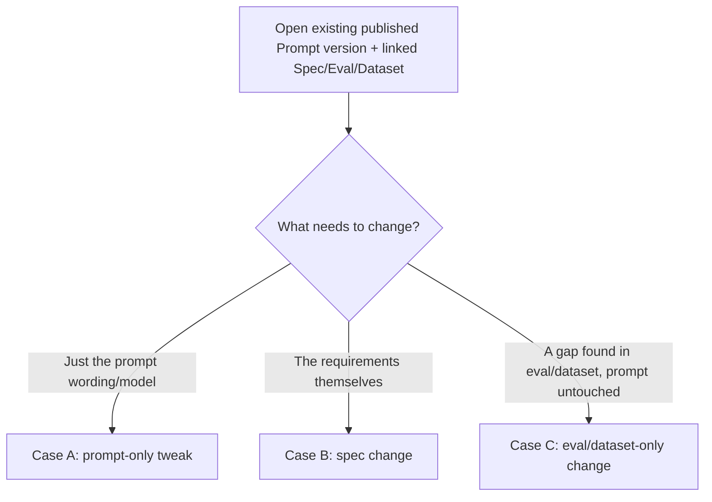

# Case 2 — Building a New Prompt Version on Top of an Older One

"On top of an older one" is not one flow — it splits into three distinct intents, depending on **what actually needs to change**. Getting this branch right matters because it determines what gets reused vs. forked, and whether the new version is proven against the old one or evaluated in isolation.

## Reuse-vs-fork at a glance

| | Spec | Assertions | Dataset | Judge | Prompt / Target | Suite |
|---|---|---|---|---|---|---|
| **Case A** — prompt-only tweak | reused as-is | reused as-is | reused as-is | reused as-is | **forked** (new Target) | **forked** (new SuiteVersion, adds new Target alongside old) |
| **Case B** — spec changed | **forked** | changed items forked, untouched items reused | changed/added rows forked, untouched rows reused | reused unless grading approach changed | usually forked (content likely needs to change) | forked |
| **Case C** — eval/dataset gap found | optionally amended (addendum) | **forked** (new/changed assertion) | **forked** (new row(s)) | reused unless the new check needs a different grader | reused as-is (no prompt change) | forked (new Suite version, same Target) |

---

## Case A — Prompt-only tweak (spec unchanged)

Wording fix, prompt-engineering improvement, model swap, temperature change — the requirements haven't changed, you just believe you can satisfy them better (or more cheaply/faster).

**Goal of this flow:** prove the new prompt is at least as good as the current one, on the exact same bar, before it can replace it.

**Does a prompt-only edit risk violating the Spec?** Only if the Spec has a requirement with no Assertion checking it — see the coverage checklist note in [02](02-workflow-starting-anew.md) step 4. As long as coverage is complete, re-running the existing Eval against the new prompt (step 5 below) *is* the check.

**Coverage-complete isn't the same as drift-proof.** Two blind spots remain even at 100% coverage: an Assertion can exist for a criterion but be too loose to catch a rephrased violation of it (e.g. a keyword-based check for "don't promise refunds" can pass a rewording that still effectively promises one), and the Dataset was built to stress-test the *old* wording, so it may not exercise the part of the input space where the new wording actually behaves differently. Neither shows up as a failing test, because nothing mechanical is wrong — it's a blind spot in what was tested, not a broken check. Two additions close this gap for Case A specifically:

- **A semantic spec-conformance pass, not just an assertion-coverage pass.** Before or alongside the comparison run, the AI review agent reads the Spec text itself against the old and new prompt content and flags any wording change that looks like it could weaken a guardrail or criterion — whether or not an Assertion currently tests it — instead of only checking whether a coverage checkbox exists.
- **The wording diff itself triggers a small batch of new, targeted dataset rows** aimed specifically at the changed part of the prompt, using the same dimension-based generation already used for dry runs, rather than relying solely on the old rows that only prove "no regression on what we already knew to check."

Both are suggestions the reviewer can accept or dismiss, never an automatic block, consistent with the suggest-first pattern used everywhere else in this design. If a gap like this is only discovered after release, the fix flows back through Case C below: the finding becomes a new Assertion or Dataset row so the same gap can't recur silently on the next Case A edit.

1. Open the existing **published** Prompt version. Because it was created (or later migrated) through this system, its linked Spec version, Eval version, and Dataset version are all visible from the same screen.
2. Edit the prompt content / model config. This creates a new **draft** `PromptVersion`, wrapped in a new draft `TargetVersion`.
3. **Do not fork the Eval or Dataset** — reuse the published versions unchanged, since nothing about what "good" means has changed.
4. Fork a new **draft** `SuiteVersion` from the last published Suite version. Instead of swapping the old Target for the new one, **add the new Target alongside the old one** (`SuiteTarget` supports more than one target per suite precisely for this comparison case).
5. Launch. One `RunGroup` fans out into **two Runs** — old prompt vs. new prompt — over the identical dataset, identical assertions, identical judge. This is a native, built-in regression gate, not a separate "Compare" tool bolted onto the side (as today's `/compare` page is).
6. Read the comparison directly: pass rate, per-assertion pass rate, cost, latency, and token counts, old vs. new, side by side.
   - **No regression, meets bar:** drop the old Target from the Suite (keep only the new one), then Publish → auto citable run → Approve → Release, same as steps 6-9 in [02-workflow-starting-anew.md](02-workflow-starting-anew.md).
   - **Regression found:** stay in the draft loop — edit the prompt again, re-run the same two-target comparison, repeat.

## Case B — The requirements changed (Spec changes)

A new business rule, a compliance addition, an edge case discovered in production, a stakeholder asking for different behavior — the bar itself needs to move, not just the prompt's ability to clear it.

1. Open the prompt's linked **Spec**. Fork a new **draft** `SpecVersion`: edit/add success criteria, guardrails, examples, or edge cases.
2. **Recommended: diff-driven regeneration, not a blind full regenerate.** The system diffs the old Spec version against the new one and proposes only the deltas:
   - New/changed criteria → new/changed `AssertionVersion`s only for those criteria. Untouched criteria keep their existing, possibly hand-tuned, `AssertionVersion`s — publishing a new Spec must not silently discard manual assertion edits that have nothing to do with the change.
   - New/changed examples or edge cases → new `DatasetItem` rows appended into a forked `DatasetVersion`. Existing rows are kept by default (additive), since the old bar is still worth checking against unless explicitly removed.
   - If the goal/output contract changed in a way that plausibly requires new prompt wording, the system proposes a **prompt content diff** — shown as an editable suggestion, never a silent overwrite of a hand-tuned prompt.
3. From here, this is the same dry-run/error-analysis/iterate loop as [02-workflow-starting-anew.md](02-workflow-starting-anew.md) steps 3-5, seeded from deltas instead of from scratch. (Judge calibration for any new `rubric_grading` assertion is optional, good practice — not a gate — per the decision in [02](02-workflow-starting-anew.md) step 6.)
4. **Run it as a comparison, same as Case A:** pin the new draft Target alongside the previous published Target in the Suite, so a single run answers two questions at once — "does the new version meet the *new* bar" and "did it regress on anything the *old* bar covered" (since old dataset rows/assertions are, by default, still present unless deliberately retired).
5. Publish → auto citable run → Approve → Release, same as before. The Approve step here should surface the **Spec diff** prominently (what changed and why), not just the prompt diff — the reviewer is signing off on a requirements change as much as a prompt change.

## Case C — Only the eval/dataset needs to evolve (prompt untouched)

**This is the most important loop in the whole system, not an edge case.** Current field practice (Hamel Husain / Shreya Shankar — see [05-eval-methodology-best-practices.md](05-eval-methodology-best-practices.md)) holds that error analysis on real outputs — not the initial spec-derived generation — is what actually makes an eval correct over time. Case C is the mechanism for feeding what error analysis finds (in a batch dry run, in a citable run, in Online Evaluation results, **or in raw production traces that were never run through any eval at all**) back into the Dataset and Assertions. That last source matters on its own, not just as a stand-in until Online Evaluation ships — Online Evaluation only ever grades the slice of traffic it's sampling, so a failure mode outside that slice, or outside what its checks were built to catch, only ever surfaces by reading raw, ungraded output. Expect to run this loop continuously, far more often than Case A or B.

**Phasing note (per the Eval Service SDD — see [06](06-sdd-alignment-and-resolutions.md)):** Online Evaluation is Phase 2, with no executor built yet. Until it ships, "error analysis on Online Evaluation traces" isn't a live source — the feeder is **ingested** results instead (imported Jenkins/PromptFoo batch reports, or manually reviewed trace exports pulled in through the same client API used for ingestion). Same destination (new Dataset rows / new Assertions), more manual sourcing until Phase 2 lands.

Typical triggers: a production incident reveals an untested edge case; error analysis on a batch of ingested/Online-Evaluation traces surfaces a new failure cluster; a new guardrail policy needs to apply retroactively; someone wants to raise the bar without believing the current prompt needs to change yet.

1. No Spec fork is strictly required (though a short addendum documenting the new criterion is good practice for traceability). No Prompt change is needed at all.
2. **PII redaction gate on promotion.** Before any real production/customer input becomes a `DatasetItem`, it must pass through PII redaction (reusing the existing redaction service already applied to online evals in the current system) — a Dataset never expires the way a Run's payload does (that's cleared automatically after 30 days), so a raw trace copied in bypasses that protection permanently unless it's scrubbed first. Synthetic/anonymized edge cases don't need this step.
3. Fork a new **draft** `DatasetVersion` (add the new, redacted-if-needed edge-case row(s), typically promoted directly from an error-analysis note — see [05](05-eval-methodology-best-practices.md)) and/or a new **draft** `EvalVersion` (add the new `AssertionVersion` — try mapping the new failure mode onto the existing promptfoo assertion library first, fall back to a small LLM-authored custom check flagged for review if nothing fits, or `rubric_grading` for genuinely subjective cases, per [02](02-workflow-starting-anew.md) step 2), reusing the **existing published Target** untouched — the current production prompt doesn't need a new version to be tested against a stricter bar.
4. Build a new **draft** `SuiteVersion` pinning: the existing published Target (unchanged) + the forked Dataset/Eval version. Launch. This checks whether the **current production prompt** already handles the newly-discovered case.
5. **If it passes:** publish just the Eval/Dataset (their own atomic freeze — no prompt version needs publishing since none was created). This raises the bar for all *future* prompt versions immediately, and — once Online Evaluation ships (Phase 2) — can be pointed at production traffic right away to confirm there's no silent regression on the new case in live traffic, without ever touching the prompt. Until then, re-check periodically via ingested batch reports.
6. **If it fails:** this is the trigger to go do Case A or B — a concrete, reproducible failing test case in hand, which is exactly what should drive the prompt edit rather than an ad hoc bug report. This is the natural feeder loop between "we found a quality gap" and "now go fix the prompt."

---

## Why multi-target Suites matter here

The data model explicitly supports several `TargetVersion`s pinned to one `SuiteVersion` as "the comparison case: the same eval and dataset are meant to run against each subject side by side." Cases A and B above lean on this directly instead of treating "compare old vs. new" as a separate feature (today's `/compare` page, which is informal and disconnected from the formal approval gate). Recommendation: **make the comparison Suite the default path for any version built on top of a prior one** — a single-target Suite becomes the exception (used only when there is no meaningful prior baseline, i.e. Case 1's starting-anew flow), not the default.
